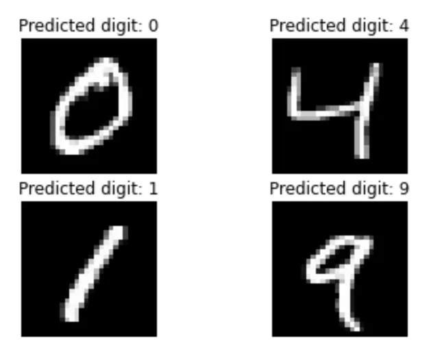
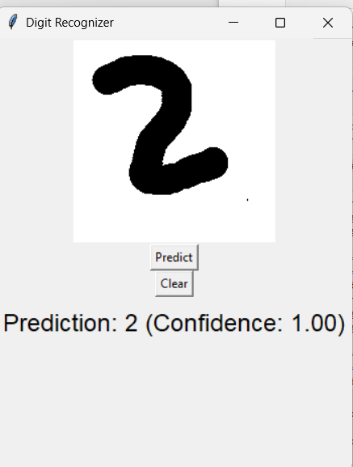

# ✍️ Handwritten Digit Recognition (MNIST)

This project uses a Convolutional Neural Network (CNN) trained on the MNIST dataset to recognize handwritten digits (0–9). It includes both a **Jupyter notebook** for training and testing the model and a **Python Tkinter GUI app** that allows users to draw digits and see real-time predictions.



---

## 📦 What's Included

- 🧠 **Model Training Notebook** – Builds and trains a CNN using TensorFlow/Keras on MNIST
- 🖼️ **Interactive GUI (Tkinter)** – Lets you draw a digit and predicts it using the trained model
- 📁 **Pre-trained Model** – Saved as `mnist_cnn_model.keras` (used by the GUI)

---

## 🧠 About the Dataset

- **MNIST Dataset**:
  - 70,000 grayscale images of handwritten digits (28×28)
  - 60,000 training + 10,000 testing samples
  - Classes: Digits 0–9

---

## 🧰 Tech Stack

- Python
- Jupyter Notebook
- TensorFlow / Keras
- Tkinter (GUI)
- NumPy, Pillow, Matplotlib

---

## 🏗️ Project Structure

├── mnist_model_training.ipynb   (Notebook for model training and evaluation)<br>
├── digit_gui_predictor.py    (GUI app to draw and predict digits)<br>
├── mnist_cnn_model.h5   (Saved trained CNN model)<br>
├── requirements.txt    (Python dependencies)<br>
└── assets/    ((optional) Sample images or outputs)<br>


---

## 🚀 Setup Instructions

### 1. Clone the Repository

```bash
git clone https://github.com/Pankaj97825/-Handwritten-Digit-Recognition-MNIST-.git
cd -Handwritten-Digit-Recognition-MNIST-
```

### 2.Install Requirements

```bash
pip install -r requirements.txt
```
Or manually:

```bash
pip install tensorflow numpy matplotlib pillow
```

---


## ✍️ Run the GUI Application

```bash
python draw_digit_ui.py
```
- A window will appear where you can draw a digit with your mouse.

- Click "Predict" to classify it.

- Click "Clear" to draw a new one.


Make sure mnist_cnn_model.h5 is in the same directory!

---

## 📈 Sample Output
You can expect predictions like:

Prediction: 2 (Confidence: 0.99)

And a GUI like this:



---
### 🙋‍♂️ Author
Pankaj Kumar<br>
GitHub: [@PankajKumar-11](https://github.com/PankajKumar-11)

